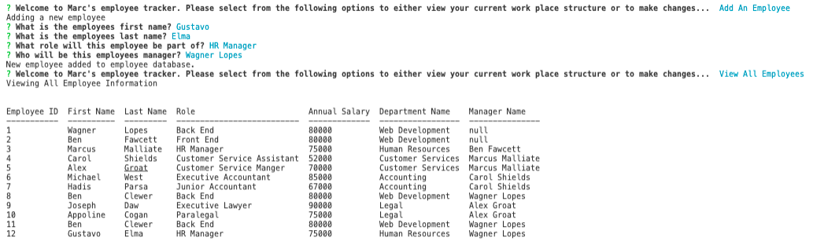

# Marcs-SQL-Employee-Tracker

  ************************

  

  ## Table of Contents
  1.  [Description](#Description)
  2.  [Installation](#Installation)
  3.  [Usage](#Usage)
  4.  [License](#License)
  5.  [Contributing](#Contributing)
  6.  [Questions](#Questions)

  ## Description
  A easy to use content management system that that allows the user to add, store and delete employees. 
  This application uses MySql, Node.js and Inquirer.

  ## Installation

  *Please clone the github repository and then run NMP I*
 

  ## Usage
  Open an integrated terminal and run node server.js. 
  Now that the app is running you can select from the options presented in the menu list. 
  When you are finished using the app simply select 'Exit'.

  ## License
 This application has the following license:
 [MIT License](https://opensource.org/licenses/MIT)

  ## Contributing
  Please email me to discuss further.

 

## Questions
*If you would like to know more or have a question you'd like to ask, please contact me via email marc.malliate@gmail.com or you may also like to checkout my work [here](https://github.com/marcmalliate)*

### You may also like to view the GitHub repository which contains the code repository: 
https://github.com/marcmalliate/Marcs-SQL-Employee-Tracker

### Screenshot of application:

Adding a New employee:

### Video demonstration of application:

© *2021 Marc Malliate - Professional Readme Generator*
